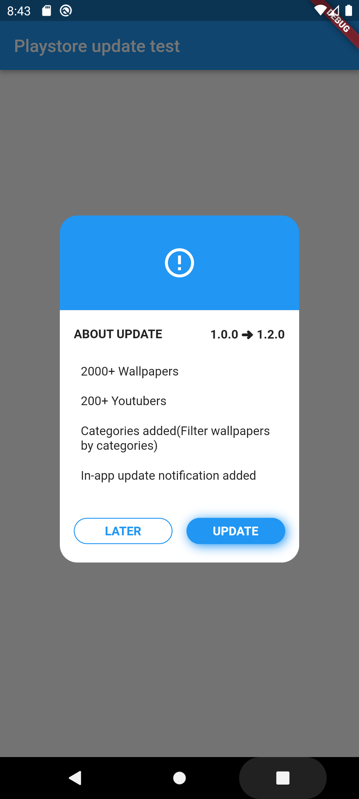
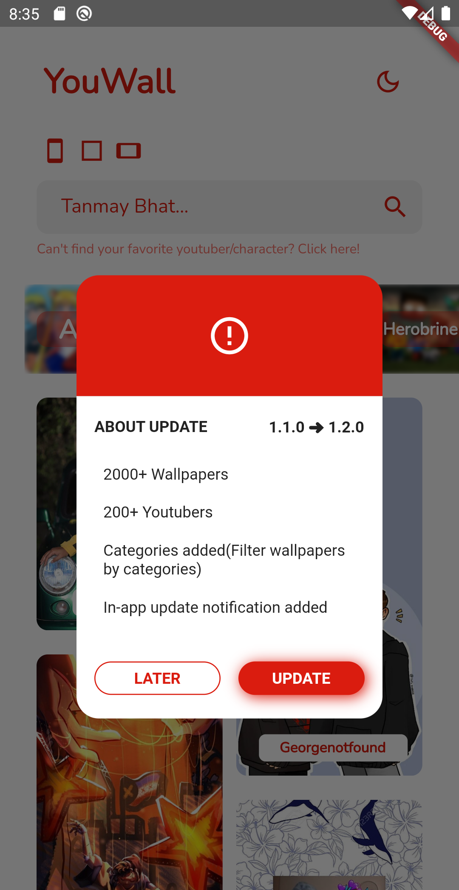

<!--
This README describes the package. If you publish this package to pub.dev,
this README's contents appear on the landing page for your package.

For information about how to write a good package README, see the guide for
[writing package pages](https://dart.dev/guides/libraries/writing-package-pages).

For general information about developing packages, see the Dart guide for
[creating packages](https://dart.dev/guides/libraries/create-library-packages)
and the Flutter guide for
[developing packages and plugins](https://flutter.dev/developing-packages).
-->

# playstore_update

A Flutter package that helps you show a popup to your users whenever you publish a new update on Google Play Store.

## Example




## Description

In this package you can show a popup to users whenever you publish a new update on Google Play Store. You can customize the popup according to your needs and this packages is still in development. This package is really very easy to use and beginner friendly. More feautures will be coming soon and it will make the package better and more customizable!

## Sample

#### Showing Popup in the init state

```
@override
  void initState() {
    // TODO: implement initState
    PlaystoreUpdate(
            context: context,
            // Allow users to dismiss the popup and allow them to use the app.
            allowDismissal: true,
            // Enter your application's package name. Example:- com.malay.youtuber.wallpaper.
            packageName: 'com.malay.youtuber.wallpaper',
            // Do you want to show the app description(What's new).
            showDescription: true,
            // Do you want users to see from from which version are they upgrading to which one/
            showVersions: true,
            // Primary color of the popup.
            primaryColor: Colors.blue)
        .checkForUpdate();
  }
```


## Author

<a class="github-button" href="https://github.com/Malay1121" aria-label="Follow @Malay1121 on GitHub">Follow @Malay1121</a>

<a class="github-button" href="https://www.linkedin.com/malay-patel-dev/" aria-label="LinkedIn: malay-patel-dev">LinkedIn: @Malay Patel</a>
